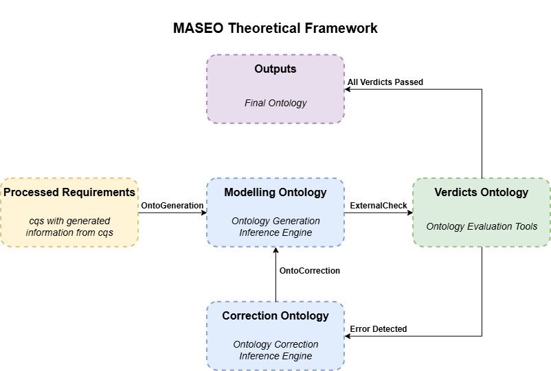
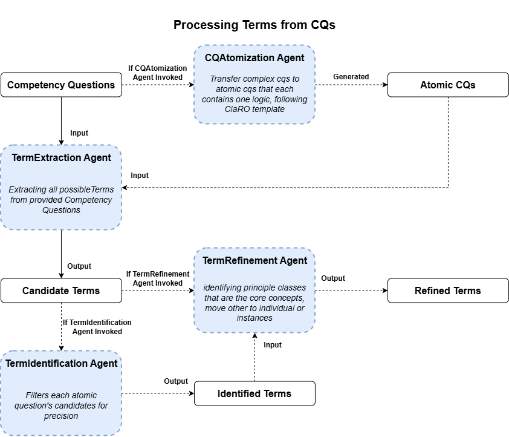
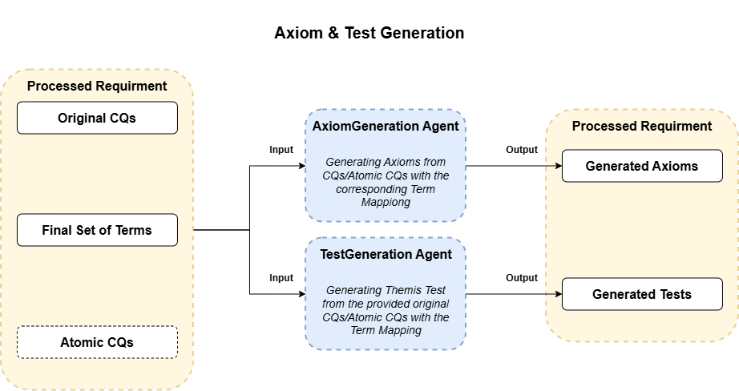
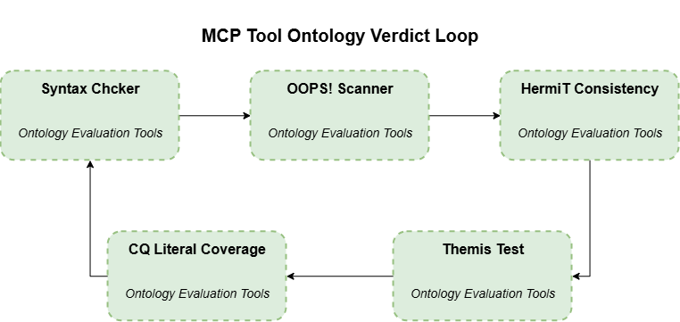

# MASEO: A Multi-Agent System for Explainable Ontology Generation


[](https://maseo.readthedocs.io/en/latest/?badge=latest)
[](https://doi.org/10.5281/zenodo.19052003)
[](https://www.repostatus.org/#active)


This repository provides the artifact for `MASEO`, a research-oriented multi-agent system that automatically generates ontologies from competency questions, with a built-in focus on explainability. It aims to make the process of ontology generation more transparent, modular, and intelligent by distributing tasks among specialized agents. Each specialized agent is designed to keep track of the logic behind each entity in the generated ontology.

## MASEO Overview

MASEO has been developed in steps, listed below from the first version to the latest. The first version is archived on Zenodo; this repository contains MASEO-Atomic and the web application built on it.

| Version | Code | Orchestration | Description |
|---------|------|---------------|-------------|
| `MASEO` | [Zenodo](https://zenodo.org/records/19051655) | [Agno](https://docs.agno.com/) workflow | The original pipeline: four agents generate the ontology, then repair its syntax, logical consistency and modelling pitfalls in turn |
| `MASEO-Atomic` | [src/maseo_atomic](src/maseo_atomic) | [LangGraph](https://langchain-ai.github.io/langgraph/) + Modular MCP servers | CQs are atomized with the CLaRO templates and processed into refined terms, axioms and tests before generation; five MCP tool servers drive the validation loop |
| `MASEO Web App` | [src/maseo_atomic_n8n](src/maseo_atomic_n8n) | [n8n](https://n8n.io/) + FastAPI + Docker | A web application that queues jobs and runs MASEO-Atomic on a server with [Ollama](https://ollama.com/), with a live pipeline diagram and file downloads |


## MASEO-Atomic

`MASEO-Atomic` is the current version of the framework. Before any ontology is written, the competency questions (CQs) go through a requirements phase: complex CQs are rewritten into atomic CQs following the [CLaRO](https://github.com/mkeet/CLaRO) templates, and the terms they need are extracted, identified and refined into one binding set of classes, properties, individuals and instances. Optional agents turn this set into axioms and Themis tests. The ontology is then generated and corrected in a validation loop driven by five MCP tool servers, and every step is recorded in a provenance ontology.

The illustration of the MASEO theoretical framework:




### Structural Overview

The pipeline consists of eight agents; five of them can be switched on or off in `config.yaml` (`generation`):

| Agent | Responsibility | Switch |
|-------|----------------|--------|
| `CQAtomization Agent` | Rewrites each CQ into atomic CQs that instantiate the 93 CLaRO templates (one asked slot, at most one relation), with a recomposition expression back to the original answer; classifies each question as `domain` or `specification` | `generation.atomic` |
| `TermExtraction Agent` | Extracts all possible terms (classes, object properties, data properties) of each atomic CQ, plus the hidden terms R1–R4 (subclasses, unnamed ranges, common superclasses, cardinality classes) | always runs |
| `TermIdentification Agent` | Filters each atomic question's candidates for precision: drops meta-level nouns and copular verbs, keeps properties that link two classes or an entity to a literal, routes named things to the individuals | `generation.identification` |
| `TermRefinement Agent` | Refines the whole batch: identifies the principle classes that are the core concepts, moves others to individuals or instances, merges near-synonyms, keeps spelling consistent | `generation.refinement` |
| `AxiomGeneration Agent` | Generates axioms from the CQs / atomic CQs with the corresponding term mapping | `axioms` in `generation.others` |
| `TestGeneration Agent` | Generates Themis tests from the original CQs / atomic CQs with the term mapping | `tests` in `generation.others` |
| `OntoGeneration Agent` | Generates the RDF/XML ontology; the refined terms are binding, and an individual is emitted as `owl:NamedIndividual` | always runs |
| `OntoCorrection Agent` | Corrects the ontology with the report of a failing tool | always runs |

| Tool (MCP server) | Check | Backed by |
|------|-------|-----------|
| `syntax_check` | well-formed, parseable RDF/XML | [rdflib](https://rdflib.readthedocs.io/en/stable/) |
| `cq_coverage` | every refined term of every CQ exists in the ontology (literal) | — |
| `oops_scan` | no Critical/Important pitfalls | [OOPS!](https://oops.linkeddata.es/) |
| `hermit_consistency` | consistent, no unsatisfiable classes | [HermiT](http://www.hermit-reasoner.com/) |
| `themis_test` | every CQ's generated tests pass (semantic); only when the TestGeneration Agent runs | [Themis](https://themis.linkeddata.es/) (`themis.jar` or REST API, `themis.mode` in `config.yaml`) |

Each tool is its own MCP server in `src/maseo_atomic/mcp_servers/`, started over stdio by `tools.py`.


### Workflow

1. **Processing Terms from CQs**: the CQAtomization Agent turns the CQs into atomic CQs; the TermExtraction Agent extracts the candidate terms; the TermIdentification Agent filters them per question; the TermRefinement Agent refines them into the final set of terms. A switched-off agent hands its input through unchanged.



2. **Axiom & Test Generation**: from the original CQs, the atomic CQs and the final set of terms, the AxiomGeneration Agent generates the axioms and the TestGeneration Agent generates the Themis tests. Both are optional and independent of each other.



3. **OntoGeneration**: the OntoGeneration Agent generates the ontology from the processed requirements (terms, and axioms and tests when generated).
4. **MCP Tool Ontology Verdict Loop**: each round runs every tool over the ontology in the order `syntax_check`, `cq_coverage`, `oops_scan`, `hermit_consistency`, `themis_test`. A tool that fails sends its report to the OntoCorrection Agent and is checked again, up to `run.tool_retries` times. A round that finds nothing ends the loop. A round that found something is followed by a verification pass over every tool; if that pass is clean the loop ends, otherwise the next round starts, up to `run.loop_rounds`. A tool that cannot run (e.g. OOPS! unreachable) is reported as a tool error, and no correction is attempted.




### Features

- **CQ atomization** — complex CQs are split into atomic CQs following the CLaRO templates, each with a recomposition expression, so a question whose atomic tests all pass is answerable
- **Staged term processing** — extraction (with hidden terms), identification and refinement produce one binding set of classes, object properties, data properties, individuals and instances
- **Axiom and test generation** — optional agents give OntoGeneration the axioms to model and the validation loop the Themis tests to pass
- **One MCP server per tool** — the five quality checks are independent MCP servers, and the tool reports drive the OntoCorrection Agent
- **Experiment toggles** — every optional agent can be switched off; the enabled agents name the output folder, so experiment arms never overwrite each other
- **Provenance ontology** — every stage, agent call (rejected attempts included), tool check, correction and term lineage is recorded in W3C vocabulary (PROV-O + EARL) in `<domain>_ontology_prov.owl`; every `dc:source` names both the atomic and the original CQ
- **Multiple LLM providers** — OpenRouter, DeepSeek or a local Ollama, with sampling and reasoning settings per provider


### External tools requirements

| Tool | Purpose | Setup |
|------|---------|-------|
| [HermiT Reasoner](http://www.hermit-reasoner.com/) | Logical consistency checking | Bundled as `HermiT.jar` (`hermit.jar_path` in `config.yaml`) |
| [OOPS! REST API](https://oops.linkeddata.es/) | Ontology pitfall detection | No local setup required — uses the public REST endpoint |
| [Themis](https://themis.linkeddata.es/) | CQ test execution | Bundled as `themis.jar` (`themis.jar_path`); it also calls `themis.linkeddata.es`, so internet access is required |
| [CLaRO](https://github.com/mkeet/CLaRO) | CQ templates for the CQAtomization Agent | Bundled as `claro_templates.txt` (`claro.templates_path`) |
| Java (JRE 8+) | Required to run HermiT and Themis | `sudo apt install default-jre` |


### Execution

Requires Python 3.10 or newer, `java` on PATH and internet access (OOPS! and Themis services). The LLM is selected by `model.provider` in `src/maseo_atomic/config.yaml`:

| Provider | Setup |
| --- | --- |
| `openrouter` | `OPENROUTER_API_KEY` in the environment (or `model.openrouter.api_key`); the model is `model.openrouter.id` |
| `deepseek` | `DEEPSEEK_API_KEY` (or `model.deepseek.api_key`); the model is `model.deepseek.id` |
| `ollama` | Ollama running with the model pulled (`ollama pull qwen3.6:27b`); the model is `model.ollama.id`, and `model.ollama.host` points to another machine's Ollama |

Install the dependencies once with [Poetry](https://python-poetry.org/) from the repository root, or with pip from `src/maseo_atomic`:

```bash
sudo apt install default-jre         # optional if java is not installed in the system
poetry install                       # from the repository root
poetry run python src/maseo_atomic/agent_graph.py <domain>   # domain: wine | awo | odrl | swo | vgo | water
# or, with pip
cd src/maseo_atomic
pip install -r requirements.txt
python agent_graph.py <domain>
```


### Configuration

| Key | Description |
| --- | --- |
| `ontology.base_uri_template` | Ontology IRI, `{domain}` is filled in |
| `model.provider` | `openrouter`, `deepseek` or `ollama` |
| `model.<parameter>` | `temperature`, `top_p`, `top_k`, `min_p`, `repeat_penalty`, `num_ctx`, `max_tokens`, `seed`, `reasoning`, `timeout`; repeated under `model.<provider>` to override them for one provider |
| `dataset.cq_dir`, `dataset.file_pattern` | Where the CQ files are |
| `run.output_dir` | Output folder with the placeholders `{mode}`, `{model_id}`, `{provider}`, `{domain}` |
| `run.parse_retries` | Attempts per agent until its reply maps to the real CQs |
| `run.tool_retries`, `run.loop_rounds` | Corrections per tool, and rounds of the validation loop (1–3 each) |
| `generation.*` | The switches of the optional agents (see the Switch column above) |
| `hermit.jar_path`, `themis.*`, `claro.templates_path` | The external tools |
| `prompts.<agent>` | Instruction and prompt template of each agent, `prompts.common` for shared blocks |


## MASEO Web App

A web application for [MASEO-Atomic](#maseo-atomic), running across four Docker containers: queue a job with your competency questions, watch the pipeline run live, and download the ontology and every step's files when it ends.

The web application is live at **[https://maseo.linkeddata.es/](https://maseo.linkeddata.es/)**, reachable from the UPM network or through the UPM VPN.

### Getting started

Download [Docker Desktop](https://www.docker.com/products/docker-desktop) for Mac or Windows. [Docker Compose](https://docs.docker.com/compose) will be automatically installed. On Linux, install [Docker Engine](https://docs.docker.com/engine/install/) with the Compose plugin. The models run in the `ollama` container, so give Docker enough memory for them (about 20 GB for a 27B model).

This solution uses Python (FastAPI) for the web app and the MASEO service, [n8n](https://n8n.io/) for the workflows, and [Ollama](https://ollama.com/) for the models.

Get the code. The `maseo` image is built from `src/maseo_atomic`, so `src/maseo_atomic_n8n` must stay next to it:

```shell
git clone https://github.com/OEG-Clark/masoe.git
cd masoe/src/maseo_atomic_n8n
```

Create the `.env` file from the example, open it, and set `N8N_ENCRYPTION_KEY` to a long random string (for example the output of `openssl rand -hex 24`). n8n encrypts its data with this key, so keep it once it is set:

```shell
cp .env.example .env
```

Run in this directory to build and run the app:

```shell
docker compose up -d --build
```

Pull at least one model for the form:

```shell
docker compose exec ollama ollama pull qwen3.6:27b
```

The first time, import and publish the two n8n workflows:

```shell
docker compose cp maseo_worker_workflow.json n8n:/tmp/maseo_worker_workflow.json
docker compose cp maseo_web_workflow.json n8n:/tmp/maseo_web_workflow.json
docker compose exec n8n n8n import:workflow --input=/tmp/maseo_worker_workflow.json
docker compose exec n8n n8n import:workflow --input=/tmp/maseo_web_workflow.json
docker compose exec n8n n8n publish:workflow --id=MaseoAtomicWorker
docker compose exec n8n n8n publish:workflow --id=MaseoAtomicWebApi
docker compose restart n8n
```

The web app will be running at [http://localhost:8080](http://localhost:8080) (on a server, `http://<server IP>:8080`).

### Checking that it runs

All four containers should be `Up`:

```shell
docker compose ps
```

[http://localhost:8080/healthz](http://localhost:8080/healthz) answers `{"ok":true}` when the whole chain works, from the web app through n8n to the MASEO service (give n8n a few seconds after a start or restart). The header of the page shows `Ollama · N models` and the state of the queue.

The logs show what each container is doing:

```shell
docker compose logs -f maseo webapp
```

After a start, they look like this:

```
maseo-1   | maseo atomic service on http://0.0.0.0:8030
maseo-1   |   maseo_atomic: /app/maseo_atomic
maseo-1   |   work dir: /data/outputs
maseo-1   |   ollama: http://ollama:11434
maseo-1   |   n8n worker: http://n8n:5678/webhook/maseo-worker  (0 job(s) queued)
maseo-1   | Processing request of type ListToolsRequest      (five times, one per MCP tool server)
maseo-1   |   MCP tools ready: cq_coverage, hermit_consistency, oops_scan, syntax_check, themis_test
webapp-1  | MASEO web app on http://0.0.0.0:8080/  ->  n8n http://n8n:5678/webhook/maseo-api  (password off)
```

To try it end to end, open **＋ New job**, type two short competency questions, switch the optional agents off and press **Add to queue**. On a machine without a GPU this small job takes a few minutes to half an hour. The job page shows every step as it runs and ends with `ALL CHECKS PASSED` or the checks that failed, and **Download all (zip)** gives its files.

### Architecture

`docker-compose.yml` runs four containers in one Compose project (`maseo`):

| Container | Image | Responsibility | Reachable from |
|-----------|-------|----------------|----------------|
| `webapp` | `maseo/webapp` (built from `webapp/Dockerfile`) | The web app (FastAPI): makes every page and sends every action to n8n | Port **8080** of the server |
| `n8n` | `n8nio/n8n:2.38.2` | Runs the two workflows below | Inside the Compose network only |
| `maseo` | `maseo/atomic-service` (built from `Dockerfile`) | `maseo_service.py`: the job queue, one endpoint per graph node, running `src/maseo_atomic`'s agents and its five MCP tool servers (Java included) | Inside the Compose network only |
| `ollama` | `ollama/ollama` | Serves the models | The server itself (`127.0.0.1:11434`) |

Here are the n8n workflows:

| Workflow | File | Responsibility |
|----------|------|----------------|
| `MASEO web app + API` | `maseo_web_workflow.json` | The API webhooks the web app calls (`/webhook/maseo-api/*`: info, jobs, job, submit, cancel, delete, download) |
| `MASEO worker (agent_graph)` | `maseo_worker_workflow.json` | MASEO-Atomic's graph drawn in n8n: claims the next job and runs its graph nodes one by one, one execution per job |

The jobs are kept in `src/maseo_atomic_n8n/outputs/`, n8n's data in the volume `maseo_n8n_data` and the models in the volume `maseo_ollama`.

### Maintenance

| To | Run |
|----|-----|
| stop and start the app | `docker compose stop`, `docker compose up -d` |
| apply a code change | `docker compose up -d --build` (and import the workflows again if a workflow file changed) |
| add or remove a model | `docker compose exec ollama ollama pull <model>`, `docker compose exec ollama ollama rm <model>` |
| update n8n or Ollama | `docker compose pull n8n ollama`, then `docker compose up -d` |
| back up the app | copy `.env` and the `outputs/` folder |

Rebuilding or restarting the `maseo` container stops the running job, so do it when the queue is idle. Do not run `docker compose down -v`: it deletes the volumes with the models and n8n's data.

### Notes

The other keys in `.env` are optional: `TZ` (time zone of the run ids), `MASEO_WEB_BIND` (the address the web app listens on, `0.0.0.0` by default), `MASEO_WEB_PASSWORD` (a password for the web app) and `N8N_VERSION`. Settings that are not on the form, such as the prompts, `tool_retries` and `loop_rounds`, come from `src/maseo_atomic/config.yaml`. For a thinking model, `reasoning_models.yaml` says what its Reasoning switch offers.

Jobs run one at a time. On a server without a GPU, a job takes from minutes to many hours, depending on the number of questions, the agents and the reasoning. Every container has `restart: always`, so the app comes back by itself after a reboot as long as Docker starts with the system (`sudo systemctl enable docker` on Linux).

The app uses the ports 8080 (the web app) and 11434 (Ollama, local to the machine). If Ollama is already installed and running on the machine, stop it first (`sudo systemctl disable --now ollama` on Linux), or `docker compose up` cannot start the `ollama` container. If the page shows a red banner saying a workflow is not published, or a job stays first in the queue without running, import the workflows again. If the model list is empty, check `docker compose ps ollama`.


## Input/Output file format

### Input

The competency questions are a JSON list of `id` / `value` pairs:

```json
[
  {"id": "CQ1", "value": "Which wine characteristics should I consider when choosing a wine?"},
  {"id": "CQ2", "value": "Is Bordeaux a red or white wine?"}
]
```

| Component | Where the file goes |
|-----------|---------------------|
| `MASEO-Atomic` | `src/maseo_atomic/dataset/<domain>_cq2onto_cqs.json`, run by domain name |
| `MASEO Web App` | Typed on the form, or uploaded as `.json` (the format above), `.csv` (`id`, `value` columns) or `.txt` (one question per line, optionally `CQ1: ...`) |

### Output

MASEO-Atomic writes these files for each domain to `run.output_dir` (e.g. `outputs/<model_id>/<mode>/<domain>/`):

| File | Content |
|------|---------|
| `<domain>_cq_terms.json` | the raw term set from the TermExtraction Agent: every CQ with its atomic CQs and their candidate terms |
| `<domain>_cq_refined_terms.json` | the final set of terms: every CQ with its atomic CQs, templates, recomposition and refined terms |
| `<domain>_axiom.json` | the AxiomGeneration Agent's result, keyed by original CQ id |
| `<domain>_tests.json` | the TestGeneration Agent's result, keyed by original CQ id |
| `<domain>_steps.json` | every step, successful and failed: each agent's input and output, each tool check with its full result and report |
| `<domain>_ontology_initial.owl` | the OntoGeneration Agent's untouched output, before the validation loop |
| `<domain>_ontology.owl` | the final ontology after the validation loop |
| `<domain>_ontology_prov.owl` | the ontology with its provenance (PROV-O + EARL, in a separate `<base>_prov#` namespace), rewritten after every correction |

The MASEO Web App gives the same files for each job, plus `run.log` and the input and output files of every step, as a zip download.


## Documentation

[MASEO documentation](https://maseo.readthedocs.io/en/latest/?badge=latest) on readthedocs: [Install](https://maseo.readthedocs.io/en/latest/install/), [Configuration](https://maseo.readthedocs.io/en/latest/configuration/), [Output](https://maseo.readthedocs.io/en/latest/output/), [Evaluation](https://maseo.readthedocs.io/en/latest/eval/)


## Acknowledgements

This work was supported by the grant [SOEL: Supporting Ontology Engineering with Large Language Models](https://w3id.org/soel) PID2023-152703NA-I00 funded by MCIN/AEI/10.13039/501100011033 and by ERDF/UE. The authors would also like to thank the EDINT (Espacios de Datos para las Infraestructuras Urbanas Inteligentes) ontology development team for sharing the project resources for evaluation purposes.
