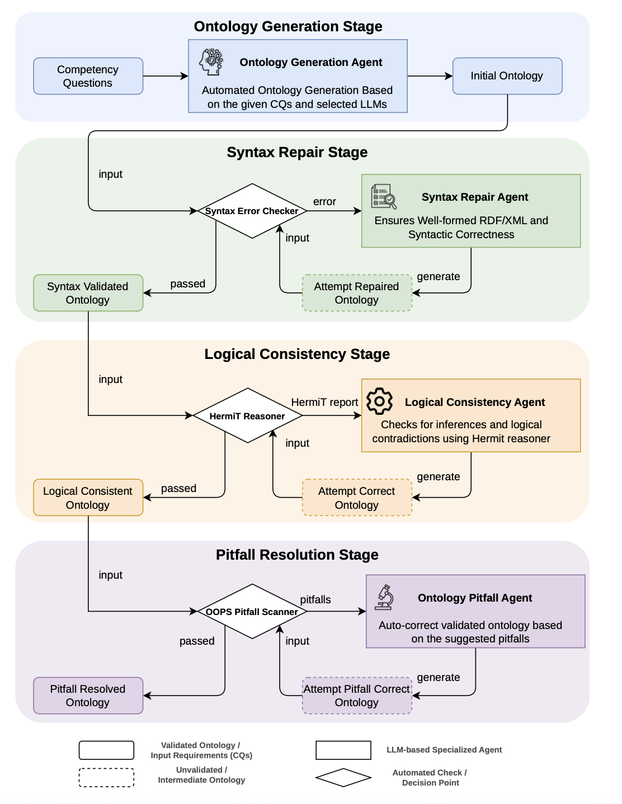

# MASEO

`MASEO` is the original implementation of the framework: four [Agno](https://docs.agno.com/) agents generate an OWL ontology from competency questions (CQs) and repair it with the reports of the external ontology tools. Each agent keeps track of the logic behind every entity it creates or changes.


## MASEO Structural Overview

The pipeline consists of four sequential stages:

| Agent | Responsibility | External Tools |
|-------|-------|----------------|
| `Ontology Generation Agent` |  Generates the initial OWL ontology from CQs | None |
| `Syntax Repair Agent` | Fixes RDF/XML syntax errors reported by the parser | [rdflib](https://rdflib.readthedocs.io/en/stable/) |
| `Logical Consistency Agent` | Repairs logical inconsistencies reported by HermiT | [HermiT Reasoner](http://www.hermit-reasoner.com/) |
| `Pitfall Resolution Agent` | Resolves ontology modeling pitfalls reported by OOPS! | [OOPS!](https://oops.linkeddata.es/) |

The illustration of the MASEO framework:




## Workflow

1. **Generate**: the Ontology Generation Agent drafts the ontology from the CQs as a list of entities (type, name, label, comment, axiom, rationale, source), which is serialized to RDF/XML.
2. **Syntax Repair**: the draft is parsed; on a syntax error, the Syntax Repair Agent receives the ontology and the parser error, up to `agents.default_retries` times. This check runs again after every later stage.
3. **Logical Consistency**: HermiT classifies the ontology; when it reports a problem, the Logical Consistency Agent repairs it.
4. **Pitfall Resolution**: OOPS! scans the ontology, and the Pitfall Resolution Agent resolves the reported pitfalls.

If a stage fails (for example, OOPS! cannot read the ontology), the whole pipeline restarts from the CQs, up to `agents.default_retries` attempts. With `--agent_method false`, only steps 1 and 2 run (single-pass generation).


### Features

- **End-to-end automation**: from a list of CQs to a validated ontology
- **Role-based agents**: each stage is handled by a dedicated LLM agent with a specific instruction and responsibility
- **Provenance tracking**: every ontology entity carries an append-only `vaem:rationale` log attributed to the agent that made each change, and a `dc:source` log linking each change back to the CQ, pitfall, or error that motivated it
- **Multiple LLM providers**: OpenRouter, DeepSeek or a local Ollama, selected in `config.yaml`
- **Batch execution**: one command runs every model in `batch.yaml` over every CQ file, with and without the agents


### External tools requirements

| Tool | Purpose | Setup |
|------|---------|-------|
| [HermiT Reasoner](http://www.hermit-reasoner.com/) | Logical consistency checking | Bundled as `hermit/HermiT.jar` (`hermit.jar_path` in `config.yaml`) |
| [OOPS! REST API](https://oops.linkeddata.es/) | Ontology pitfall detection | No local setup required — uses the public REST endpoint (`oops.api_url`) |
| Java (JRE 8+) | Required to run HermiT | `sudo apt install default-jre` |


## Installation

Python 3.10 or newer. The repository's `pyproject.toml` follows MASEO-Atomic, so install MASEO's dependencies with pip:

```bash
cd src/maseo
pip install agno rdflib requests beautifulsoup4 pydantic pyyaml
pip install openai          # OpenRouter and DeepSeek models
pip install ollama          # a local Ollama model
```

The API key is read from `OPENROUTER_API_KEY` or `DEEPSEEK_API_KEY`, or from `model.<provider>.api_key` in `config.yaml`.


## Execution

MASEO supports execution over a single set of competency questions with a specific LLM (CLI Execution), as well as a batch run over a selection of models and sets of competency questions over various domains (Batch Execution).

### CLI Execution

```bash
cd src/maseo
python -u cli.py \
    --config       ./config.yaml \
    --cqs_file     ./dataset/cqs/wine_cqs.json \
    --save_file    ./wine.owl \
    --agent_method true
```

| Argument | Required | Description |
| --- | --- | --- |
| `--config` | No | Path to `config.yaml`. Defaults to `./config.yaml`. |
| `--cqs_file` | Yes | JSON file with competency questions: `[{"id": "CQ1", "value": "..."}, ...]`. |
| `--save_file` | Yes | Where to write the produced OWL ontology. |
| `--agent_method` | No | `true` (default) runs the full multi-agent pipeline; `false` runs single-pass generation only. |

### Batch Execution

To sweep multiple models and competency-question files in one command, use `run_batch.py`:

```bash
cd src/maseo
python -u run_batch.py --batch ./batch.yaml
```

`batch.yaml` only contains the list of models that you wish to run.
```yaml
models:
  - provider: openrouter
    id: qwen/qwen3.6-flash
  - provider: deepseek
    id: deepseek-v4-flash
  - provider: ollama
    id: qwen3:32b
  ...
```

Place your competency-question files in `./dataset/cqs/`. For every `(model, cqs_file)` pair the runner invokes MASEO generation (`--agent_method true`) and normal agent generation (`--agent_method false`). All generated ontologies and log files are saved independently.

| Argument | Description |
| --- | --- |
| `--batch` | The model list. Defaults to `./batch.yaml`. |
| `--config` | The config used as a template for each model. Defaults to `./config.yaml`. |
| `--cli` | Path to `cli.py`. Defaults to `./cli.py`. |
| `--force` | Run again the combinations whose outputs already exist (skipped by default). |
| `--dry_run` | Only list the planned runs. |
| `--keep_temp` | Keep the temporary config `./dataset/.run_config.yaml`. |


## Configuration

All MASEO behaviour is controlled by `config.yaml`:

| Key | Description |
| --- | --- |
| `ontology.base_uri` | Base IRI of the generated ontology |
| `model.provider` | `openrouter`, `deepseek` or `ollama` |
| `model.max_tokens`, `model.temperature` | Generation settings for every agent |
| `model.<provider>.id`, `model.<provider>.api_key` | Model id and key of each provider (`model.ollama.host` for a remote Ollama) |
| `agents.default_retries` | Syntax repair attempts, and full pipeline restarts |
| `oops.api_url`, `oops.request_template` | OOPS! endpoint and the XML request template |
| `hermit.jar_path` | Path to `HermiT.jar` |
| `prompts.<agent>` | Name, role, instruction and prompt template of each agent |

The full document for configuration can be found at: [Configuration](https://maseo.readthedocs.io/en/latest/configuration/)


## Output

| File | Content |
|------|---------|
| `--save_file` | The final RDF/XML ontology; every entity carries `vaem:rationale` and `dc:source` |
| `dataset/agent/<model>/ontology/<name>_agent_ontology.owl` | Batch: the MASEO ontology of each model and CQ file |
| `dataset/agent/<model>/log/<name>_agent_log.txt` | Batch: the console log of that run |
| `dataset/normal/<model>/ontology/<name>_normal_ontology.owl` | Batch: the single-pass ontology |
| `dataset/normal/<model>/log/<name>_normal_log.txt` | Batch: the console log of that run |

The full document for output file structure can be found at [Output](https://maseo.readthedocs.io/en/latest/output/)
